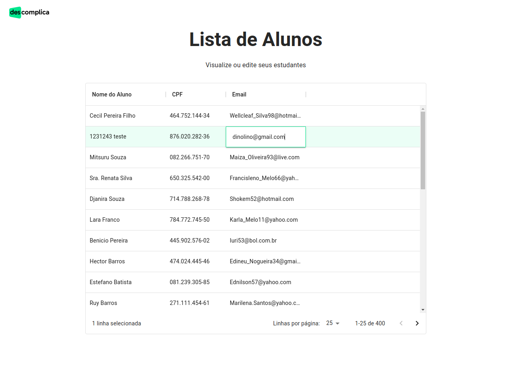
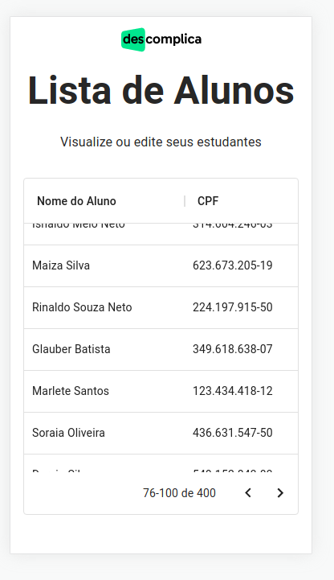

<br/>
<p align="center">
  <h3 align="center">Desafio Técnico Descomplica
</h3>

  <p align="center">
    Lista de Alunos feita com Koa, Apollo GraphQL e Next
    <br/>
    <br/>
    <a href="https://descomplica-technical-challenge.vercel.app/">Veja a Demo</a>
  </p>
</p>


## Técnologias

Essa são as principais que optei para desenvolver a aplicação:

- [Next.js](https://nextjs.org/) (Framework React)
- [MUI](https://mui.com/)
- [Koa.js](https://koajs.com/)
- [MongoDB](https://www.mongodb.com/)
- [Mongoose](https://mongoosejs.com/)
- [Apollo GraphQL](https://www.apollographql.com/)

Optei por Next.js, em função de alternativas SPA como o CRA ou VITE, pois na minha opinião é o que fornece a melhor expêriencias de desenvolvimento. A possiblidade de fazer SSR ou SSG não foi o determinante, mas todas as otimizações e recursos que por default ele já fornece.

O banco Mongo foi escolhido devido a natureza dos dados, como são apenas informações sem nenhum relacionamento não havia a necessidade de usar um banco relacional.

## Demo

Eu fiz o deploy da API pelo Heroku e da UI pela vercel.

API: <https://descomplica-challenge.herokuapp.com/>

UI: <https://descomplica-technical-challenge.vercel.app/>

Ah, não se preocupem com os dados. Os gerei usando o faker 🙂

## Imagens do projeto

Versão desktop:


Versão mobile:



## Começando

Para rodar localmente a aplicação siga os próximos passos.

### Pré requisitos

Antes de começar, você precisa ter os seguintes programas instalados:

- [Git](https://git-scm.com)
- [Node](https://nodejs.org/en/)
- [Docker](https://docs.docker.com/get-docker/) e [Docker-compose](https://docs.docker.com/compose/install/)
- [Yarn 1](https://classic.yarnpkg.com/lang/en/):

```sh
npm install yarn -g
```

### Instalação

1. Clone o repositório

```sh
   git clone https://github.com/gabrielclaudino/descomplica-technical-challenge.git
```

2. Suba o banco de dados e rode o seed

```sh
   cd api
   docker-compose up -d
```

3. Instale as dependências na UI e na API:

```sh
  $ yarn # na pasta ui
  $ yarn # na pasta api
```

4. Crie um arquivo de ambiente para a api (`api/.env`), veja o[`api/sample.env`](./api/sample.env).

5. Crie um arquivo de ambiente para a ui (`ui/.env.local`), olhe [`ui/sample.env`](./ui/sample.env).

## Como usar

```sh
cd api && yarn run dev
cd ui && yarn run dev
```

O <http://localhost:3000> rodará a API e no <http://localhost:3001> a UI.

Caso queira rodar um reverse-proxy localmente, na raiz do projeto existe um `Caddyfile`. Se você tiver o [Caddy](https://caddyserver.com/) instalado basta rodar no terminal.

```sh
sudo caddy run
```

A UI vai estar rodando neste endereço: <https://ui.descomplica.localhost>

A API vai rodar aqui: <https://backend.app.localhost/>

<!-- TESTS -->

## 📝 Licença

Distribuído sob a licença MIT. Veja o arquivo `LICENSE` para mais informações.

## Author

👤 **Gabriel Claudino**

- Github: [@gabrielclaudino](https://github.com/gabrielclaudino)
- LinkedIn: [@gabrielhenriqueclaudino](https://linkedin.com/in/gabrielhenriqueclaudino)
